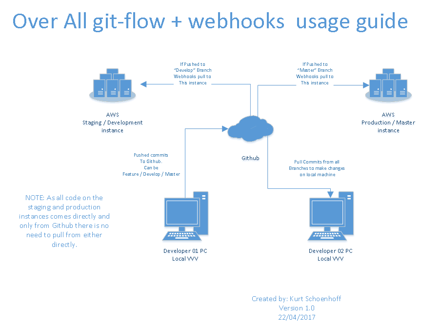

# a2-cp3402-2017-team12

##Assignment 2 - Cairns Team 2:##
Linda Wex
Kurt Schoenhoff
Adam Nicollas

## Gitflow / Webhooks usage ##

### "Feature" Branches ###
To be used for local and shared development.
* Must be pushed to github.
* Must be named appropriately. (do we need to have a convention or is there one already?)
* Major commits should be pushed to github.
* Minor commits it is your choice to push or not. 

### "Develop" Branch ###
This is automatically pulled to the staging server!
* To be used for finished features.
* To be used for bugs in this branch.
* If a finished feature is too buggy or breaks the develop site please consider reverting it to a feature and rolling back the develop brance to the develop is still working.

### "Master" Branch ###
This is automatically pulled to the production server!
* This is for final working code only!
* Any bugs or glitches revert to develop branch!
* This branch should always work!

## Helpfull links and info ##

[Markdown cheat sheet](https://github.com/adam-p/markdown-here/wiki/Markdown-Cheatsheet "Markdown Cheat Sheet")

###testing...2
